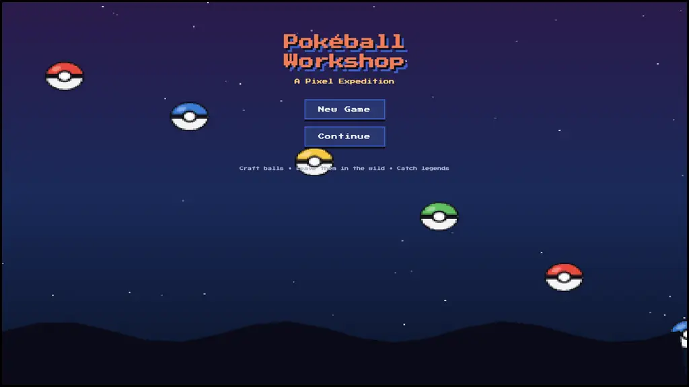
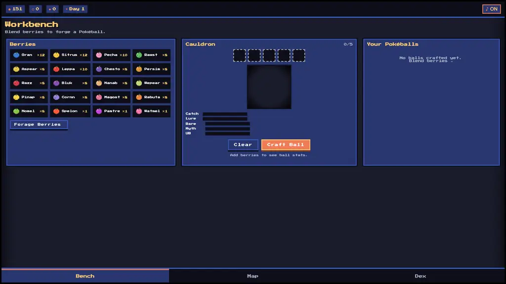

# Pokéball Workshop — A Pixel Expedition

This game is Rio's very own concept. He wanted to build a game where you can combine all different berries to create a poe


## Screenshots





## Run
No build step needed — it's a static site. Just open `index.html` in a browser, or serve the directory with any static server:

```bash
python3 -m http.server 8000
# open localhost:8000
```
